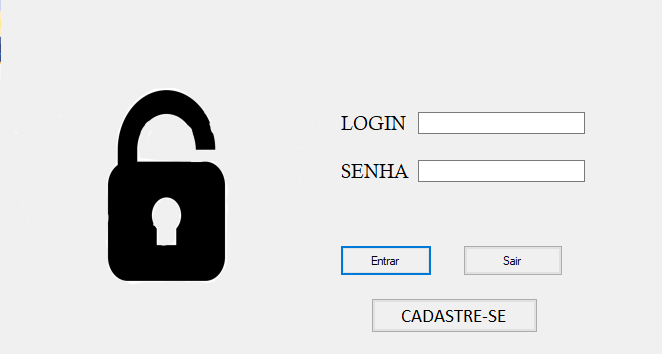
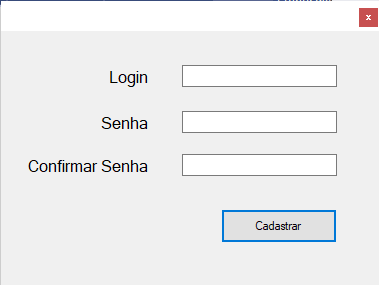
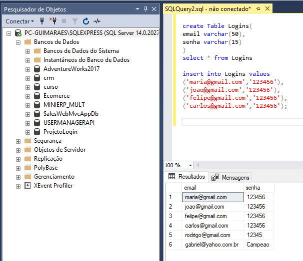

# Tela de cadastro de login

Programa realizado em windows form, para fazer uma aplicação de validação e cadastro de login e senha do usuario e conexão com o banco de dados SQL Server.

# Layout Tela de Login

 

Aqui o usuario colocar seu login e senha, e o sistema verifica no banco de dados se o login e senha fornecido pelo usuario existe no banco de dado, se sim o sistema exibe uma tela de "Bem-vindo", se não o sistema uma tela com uma mensagem de erro.

# Layout Tela de Cadastre-se

Se o usuário não for cadastrado no banco de dados do sistema, pode clicar no botão "Cadastre-se" e abrira essa tela para ele cadastrar seu login, senha e confirmar senha.

# Banco de dados

Aqui a principio inseri alguns registros, para depois validar o login e senha na tela de fazer login.

